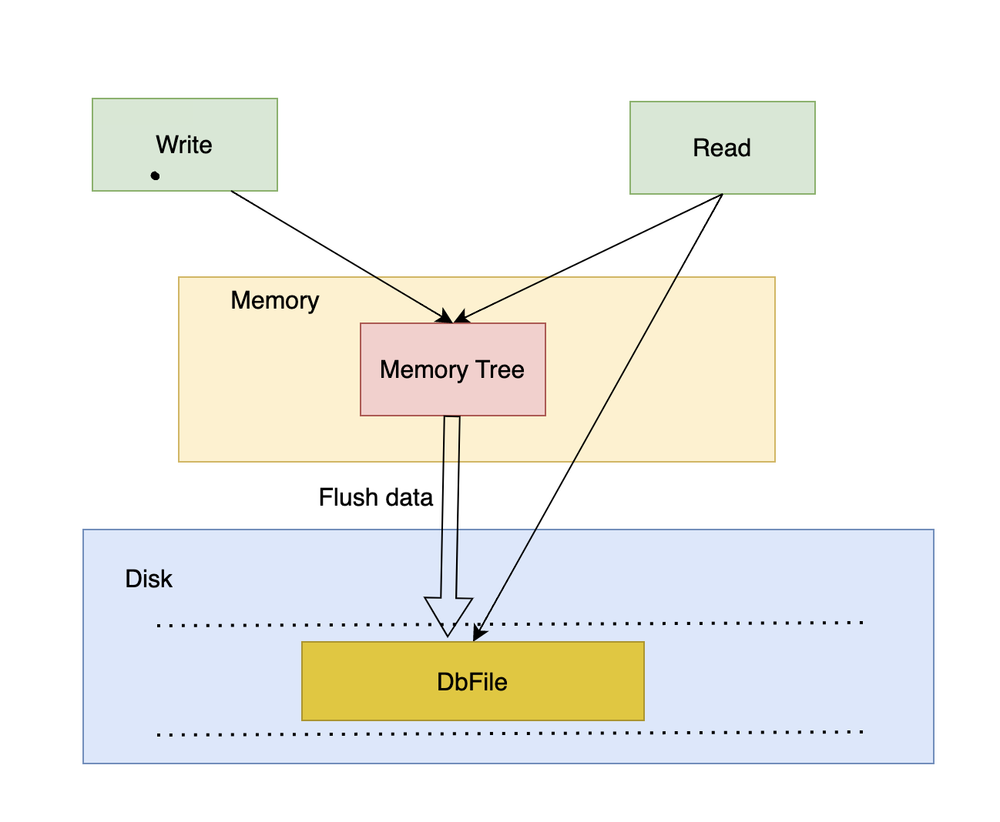

# SimpleKV

This project is a simple key-value store database that exploits log-structured merge-tree.

## MemoryTree

The MemoryTree is a binary sort tree for buffering write operations and data reads.

## DbFile

The Key/Value stored in the MemoryTree cannot be too much, otherwise it will take up too much memory. Therefore, when the number of Keys in the MemoryTree reaches the threshold, the data is written to DbFile.
